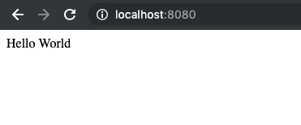
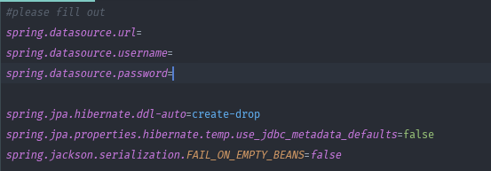
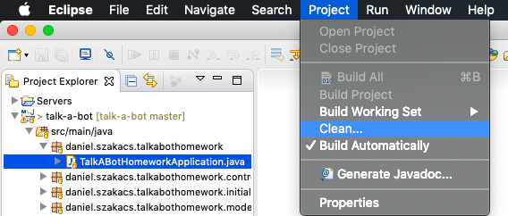
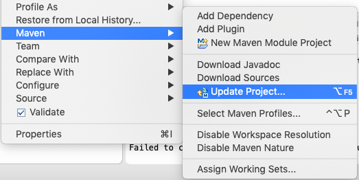
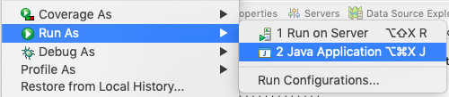

#HelloWorld Talk-a-bot Homework.

The main goal is to return a text (Hello World) from the database.         
                                 
                                 
#How to run it...
1. Open the project in Eclipse.                             

2. Before running the application, please add your local database connection.     
                             
   
3. Click Project, Clean             
                  
                    
4. Right click to the project. Click Maven / Update Project...                                                 
                                              
5. Open the main class (Path: /src/main/java/daniel/szakacs/talkabothomework/TalkABotHomeworkApplication.java)                                       
6. Right click, Run As, Java Application                                                        
                                                        

                    